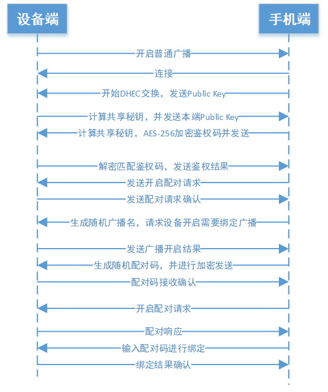
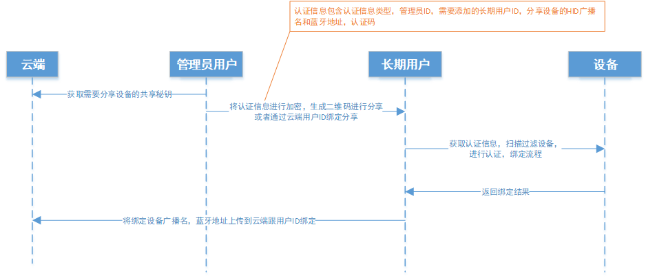
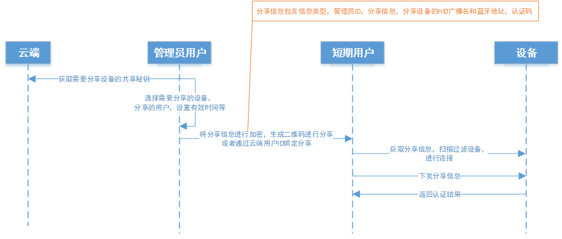
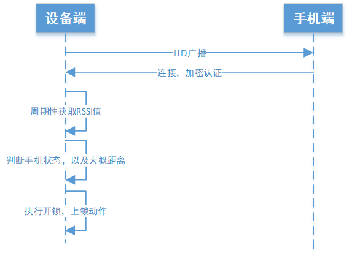
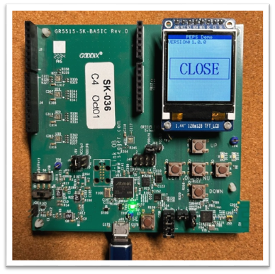
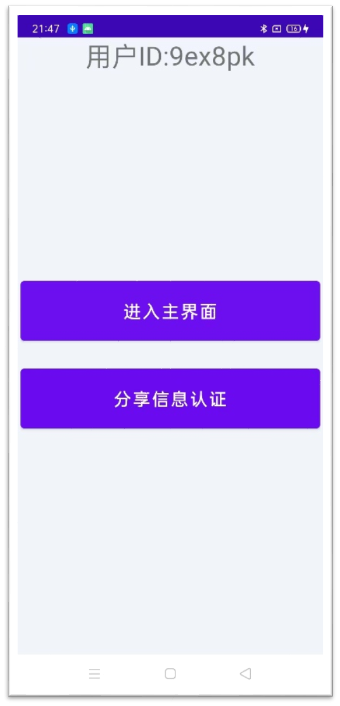
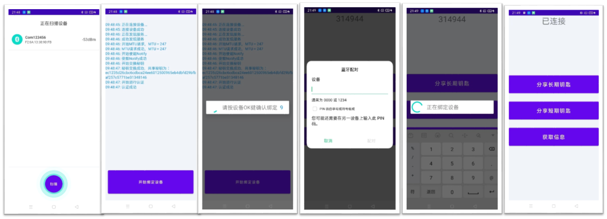
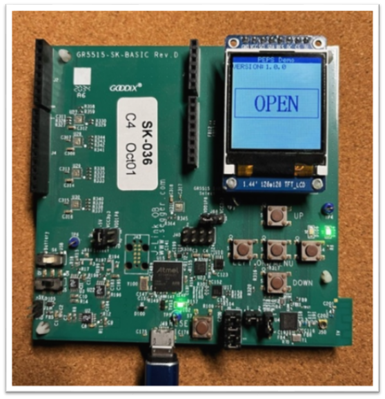
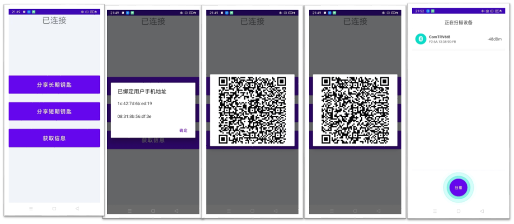

# BLE应用参考：靠近解锁

## 1. 仓库说明

本仓库是基于 GR551x 蓝牙SoC设计的靠近解锁演示程序. 仓库根目录包含3个文件夹:

- android_app : Android App演示程序源码, 用于靠近解锁手机控制授权侧的演示
- device : 设备侧工程参考源码. 可编译烧写到GR551x SK, 用于靠近解锁设备侧的演示
- firmware : 预先编译好的 apk文件 (安装在Android手机) 和 bin 文件(烧写到SK板). 在用户没有构建好编译环境时可预先安装/烧写体验靠近解锁 演示程序 

## 2. 参考示例特点

靠近解锁的示例工程具备如下特点:

- 安全的认证配对流程
- 支持多个手机靠近解锁，远离上锁
- 支持车钥匙分享，可定义有效时间，通过手机扫描连接进行开锁，远离上锁
- 设备端不需要网络接入，鉴权，秘钥认证本地化运算
- 靠近解锁，RSSI检测
- 3从机方式，模拟3个独立设备，普通连接，HID连接，FMNA连接互不影响，可进行丰富的功能扩展，开发简单 (注:  示例工程的HID功能目前未完全实现, 但不影响其他功能演示)

## 3. 参考示例要点设计

### 3.1 系统角色定义

在方案系统中，有用户ID，手机，设备3个角色

- 初次使用时，使用用户ID登录指定APP，进行设备绑定，初次绑定设备用户会默认成为管理员，拥有管理员权限：分享短期钥匙、管理长期用户，只有管理用户才能进行短期秘钥分享，只有长期用户才拥有靠近开锁权限
- 长期用户跟用户ID进行绑定，靠近开锁权限跟手机进行绑定
- 同一个ID可以绑定多个设备，同一个设备可以被多个长期用户绑定

### 3.2 系统关键信息说明

- 用户ID：登录手机APP，云端存储信息跟用户ID绑定
- 手机端蓝牙地址：手机端跟设备绑定后，设备端会记录绑定手机的MAC地址
- 设备端普通广播名和广播数据：普通广播用于长期用户绑定时的认证信息交互，短期用户的秘钥认证通道，普通广播数据中含有特殊的标志数据，长期用户在绑定，短期用户在进行连接时，手机会对广播数据进行过滤识别。
- 设备端HID广播名和蓝牙地址：第一次配对时，手机端会随机产生HID广播名（广播名是固定字符+随机字符生成），绑定成功后，会将广播名，MAC地址存储在云端，跟用户ID绑定
- FMNA广播名：用于Apple Find My功能 
- 共享秘钥：管理员用户第一次与设备绑定成功后，设备端会把认证时的共享秘钥保存，手机端也会将这个共享秘钥保存在云端跟用户ID绑定。在后面的使用中，手机端会定期跟设备端同步更新这个共享秘钥，这个共享秘钥会用于长期用户分享和短期用户分享认证信息的加密秘钥。

### 3.3 安全配对绑定流程

- 使用多从机方式进行认证配对，设备出厂默认使用普通广播，手机与设备蓝牙进行连接，需要进行鉴权认证，鉴权过程使用ECDH进行秘钥交换，鉴权数据使用交换的秘钥进行AES-256加密，每一次连接秘钥随机，即使抓取空口数据也没法破解。
- 鉴权通过后，开启配对，需要用户在设备端进行确认操作（比如长按按钮），防止配对到其他设备，配对开启后，设备端会开启HID广播，并且广播名字会进行随机化，保证配对的唯一性，配对密码会在手机随机生成，并使用交换的秘钥进行加密，发送给设备，手机端在配对弹框中输入生成的密码进行配对。

 

### 3.4 长期用户分享流程

- 管理员用户添加长期用户时，需要登录APP创建一串认证数据，此数据具有一定的时效性，并具有一次性使用特性，其中需要给设备进行认证的信息会使用共享秘钥进行加密，长期用户解析认证数据，匹配成功后，会连接设备，将加密的认证信息发送给设备进行匹配。

 

### 3.5 短期用户分享流程

- 只有管理用户才能进行短期秘钥分享，管理用户登录APP，进行设置界面，选择需要进行短期钥匙分享的设备，短期秘钥有一次性和时效性特点
- 短期用户登录APP，对短期认证信息进行解析匹配，过滤广播中设备，进行连接，发送分享信息，设备端进行解密匹对，开锁。

### 3.6 靠近解锁流程

- 与设备进行绑定过的手机，在蓝牙开启状态下，靠近设备时，手机系统会自动与设备进行连接，不需要任何APP的参与
- 设备与手机连接上后，设备端会周期性获取RSSI值，通过算法计算手机是靠近还是远离，以及离设备的大概距离，当处于靠近状态，并距离达到一定阙值，可开锁，当处于远离状态，并距离达到一定阙值，关锁。

 

## 4. 示例工程演示

### 4.1 准备程序

- 设备侧: 编译设备侧程序, 或使用仓库下已编译好的bin, 通过 GProgrammer软件下载到 GR5515 SK 板 (带屏幕)，开机效果如下:

   

- 在Android手机上安装app peps.apk，打开 APP，会显示用户ID（随机生成）, 如图:

   

  

### 4.2 程序演示

点击APP按钮 **进入主界面**:

- 如果未绑定会进入扫描绑定界面
- 如果已经绑定设备，会直接进入操作界面；可分享信息认证用于扫描短期钥匙和长期钥匙分享的二维码。

#### 4.2.1 扫描绑定

 

- 点击 进入主界面,还未进行过绑定的情况下, 会进入扫描界面. 确保GR5515 SK已下载设备程序并正常运行, 点击扫描按钮, 会扫描到名为 Com123456 的广播
- 点击广播名连接设备，进行秘钥交换，并进行匹配码认证。出现 "开始绑定设备" 按钮
- 点击 "开始绑定设备", 弹出"请按设备OK键确认绑定"弹窗时, 按下 SK 板上的 OK 键确认，进行配对码秘钥传输，并让设备开启HID广播
- APP连接上指定的HID广播， 等弹出蓝牙配对 弹窗, 输入弹窗后阴影区显示的配对码. 点击配对
- 等待绑定过程完成
- 绑定成功后, 会来到已连接界面. 此时可以进行密钥分享等操作. 

接下来可以进行靠近解锁功能演示

#### 4.2.2 靠近解锁演示

- 上述章节的配对绑定操作完成后, SK板屏幕字符显示会变为 OPEN状态. 表示当前处于近距离解锁状态
- 手持绑定设备的手机, 逐步远离 GR5515 SK板, 随着BLE RSSI强度逐步下降，直至SK屏幕显示 "CLOSE". 表示当前处于离开上锁状态
- 再手持绑定设备的手机逐步靠近 GR5515 SK板, 随着BLE RSSI强度逐步加强，直至SK屏幕显示 "OPEN". 表示当前处于重新解锁状态 

 

解锁/上锁的算法逻辑, 可以从源码中查看. 用户也可以根据情况, 进行算法的升级优化.

#### 4.2.3 分享密钥演示

 

- 设备连接绑定后, App处于已连接界面
- 点击 "获取信息", 可以查看已绑定用户手机设备的蓝牙mac 地址
- 点击分享长期秘钥，会生成长期秘钥二维码，二维码信息包含有效时间，设备广播名信息，并进行了加密
- 点击分享短期秘钥，会生成短期秘钥二维码，二维码信息包含有效时间，设备广播名信息，并进行了加密
- 点击另外一台的分享信息认证按钮，会打开摄像头扫描二维码，解密获取二维码信息，校验后扫描特定的广播设备

长期密钥用户可以长时间的使用 设备的靠近解锁功能, 短期密钥用户可以根据需要, 开发按次或者时间段使用靠近解锁功能.

#### 4.2.4 视频演示

上述操作过程, 已录制视频进行演示, 可跳转观看.

- [汇顶BLE芯片典型应用场景：两轮车的靠近解锁方案 | PEPS | Goodix BLE | GR551x | GR552x | GR533x_哔哩哔哩_bilibili](https://www.bilibili.com/video/BV1Wb421H7kg/?vd_source=849be8d36cdf256cbd8e61ecdc3316ea)

### 4.3 示例程序重置

当设备端和App进行绑定后, 如果需要解绑重置, 可进行如下操作:

- 设备侧: 长按 LEFT 键至少10秒以上, 通过串口观察日志窗口, 当出现 “Reset Device” 字样时松开, 设备侧清楚帮忙信息, 完成重置
- App侧: 退出App重新进入, 在 **分享认证信息** 按钮下侧空白处,连续点击 10次以上, 出现是否重置提示弹窗, 清楚相关绑定信息，完成重置.

上述相关逻辑可以从源码相关位置查看. 完成重置后, 又可以重新进行扫描绑定等操作演示.